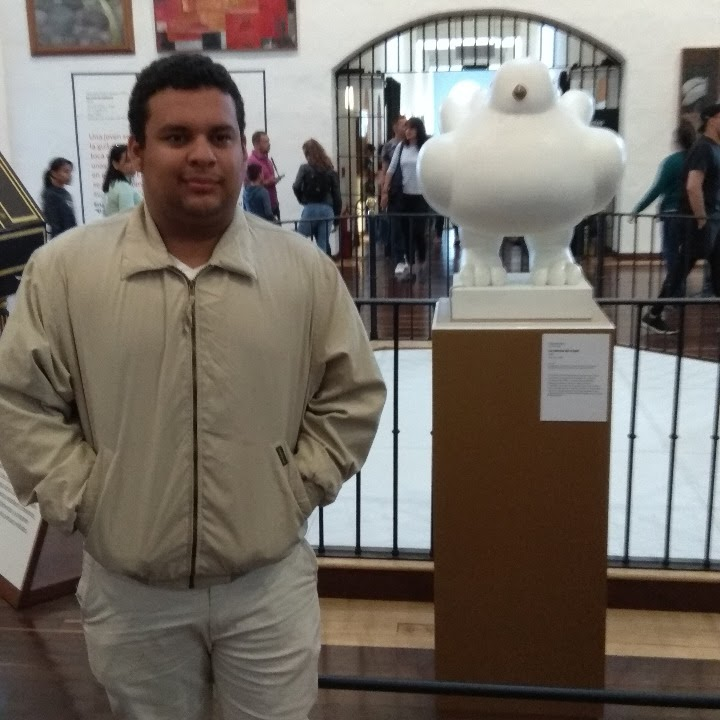



	

		
		
			Randy Steven Consuegra Ortega, M.Sc. in Computer Science. Data-Driven Models for Variational Data Assimilation. <a href="https://sites.google.com/view/rsconsuegra/home" target="_blank">Website</a>
		
	

	

		
		
			Juan Sebastian Rodriguez Donado, M.Sc. in Computer Science. Data Assimilation Method for Air Quality Estimation.
			<a href="https://sjdonado.github.io" target="_blank">Website</a>
		
	

	

		
		
			Andres Felipe Movilla Obregon, M.Sc. in Computer Science.
			<a href="https://andremov.github.io" target="_blank">Website</a>
		
	

	

		
		
			Omar Angel Mejia Suarez, M.Sc. in Computer Science. Data Assimilation Method for Air Quality Estimation. Website
			<a href="https://sites.google.com/view/omarmejiasuarez/inicio" target="_blank">Website</a>
		
	

	

		
		
	

	

		
		
			Alfonso Manuel Mancilla Herrera, Ph,D. in Computer Science, Non-Linear Data Assimilation Methods.
		
	

	

		
		
			Felipe Jose Acevedo Garcia, M.Sc. in Computer Science.
		
	

	

		
		
	

