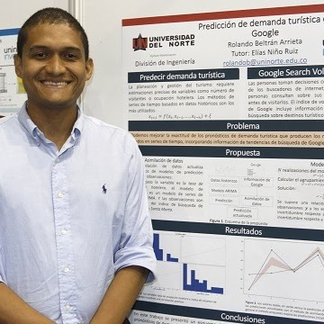

	

		
		
			Juan C. Calabria Sarmiento, Ph.D. in Computer Science, Data Assimilation Methods for Wind Energy Potential Estimation. (2020).
		
	

	

		
		
			Luis Gabriel Guzman Reyes, Ph.D. in Computer Science, Shrinkage Covariance Matrix Estimation in Ensemble-Based Data Assimilation. (2020).
			<a href="https://sites.google.com/view/luis-guzman/home" target="_blank" rel="noreferrer">Website</a>
		
	

	

		
		
			Rolando Beltran Arrieta, Ph.D. in Computer Science, Non-Linear Data Assimilation via Sampling Methods. (2019).
		
	

	

		
		
			Luis Ernesto Morales Retat, M.Sc. in Computer Science, Soft Computing Methods for Optimal Radius of Influence Estimation in Ensemble Based Data Assimilation. (2018).
		
	

	

		
		
			Alfonso Manuel Mancilla Herrera, Ph,D. in Computer Science, Non-Linear Data Assimilation Methods. (2021)
		
	

	

		
		
			Randy Steven Consuegra Ortega, M.Sc. in Computer Science. Data-Driven Models for Variational Data Assimilation. (2021) <a href="https://sites.google.com/view/rsconsuegra/home" target="_blank" rel="noreferrer">Website</a>
		
	

	

		
		
			Felipe Jose Acevedo Garcia, M.Sc. in Computer Science. (2022)
		
	

	

		
		
			Juan Sebastian Rodriguez Donado, M.Sc. in Computer Science. Data Assimilation Method for Air Quality Estimation. (2022)
			<a href="https://sjdonado.github.io" target="_blank" rel="noreferrer">Website</a>
		
	

