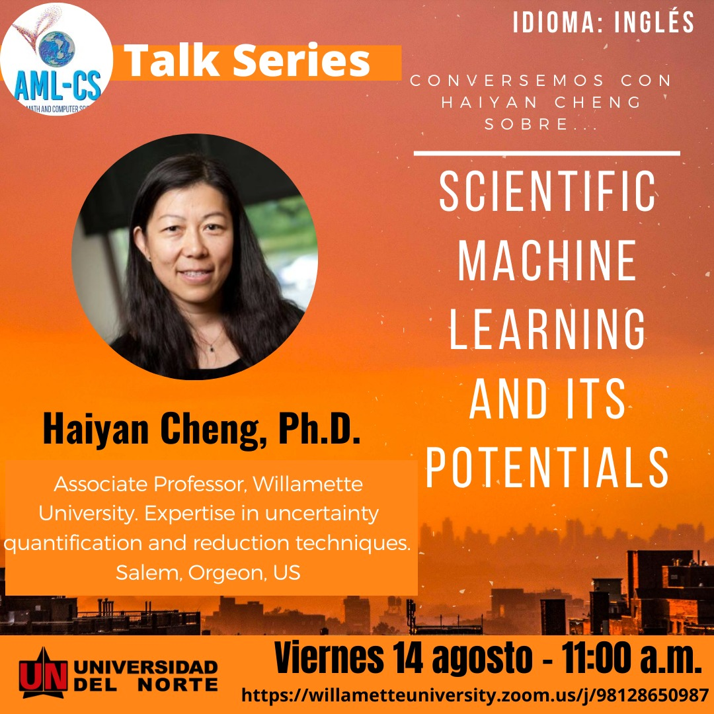
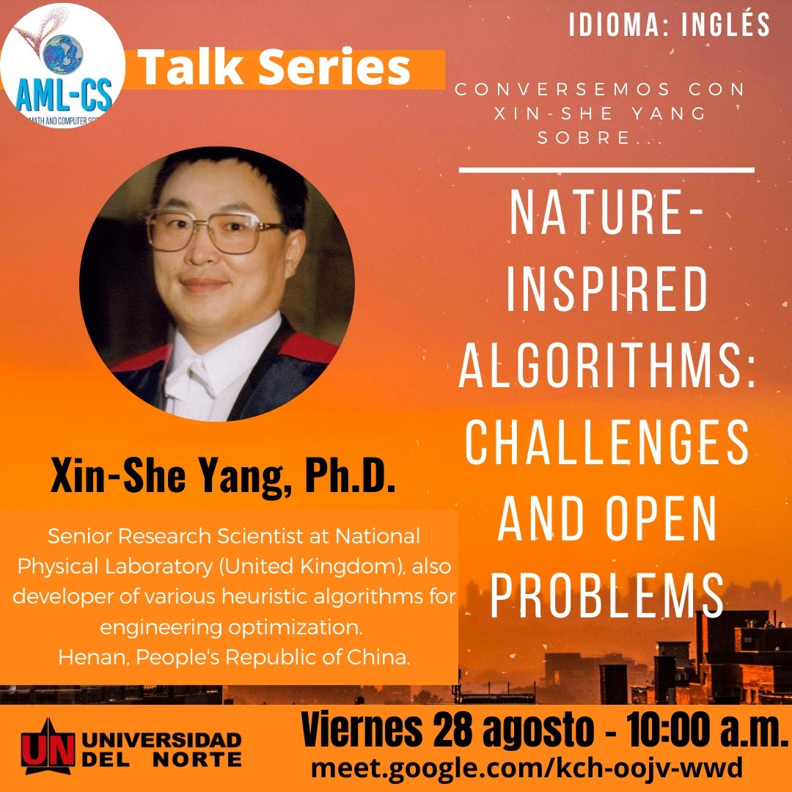



	

    
		
      <b>31/07/2020 - Spanish</b>
			Algunos Aspectos Teóricos y Prácticos de la Asimilación de Datos en la Predicción Meteorológica. Centro de Modelización Matemática (MODEMAT)l, Ecuador.
		
	

  

    
		
      <b>14/08/2020 - English</b>
			Scientific Machine Learning and its Potentials. Associate Professor, Willamette University, USA.
		
	

  

    
		
      <b>28/08/2020 - English</b>
			Nature-Inspired Algorithms: Challenges and Open Problems, Senior Research Scientist at National Physical Laboratory, MiddleSex University, UK.
		
	


