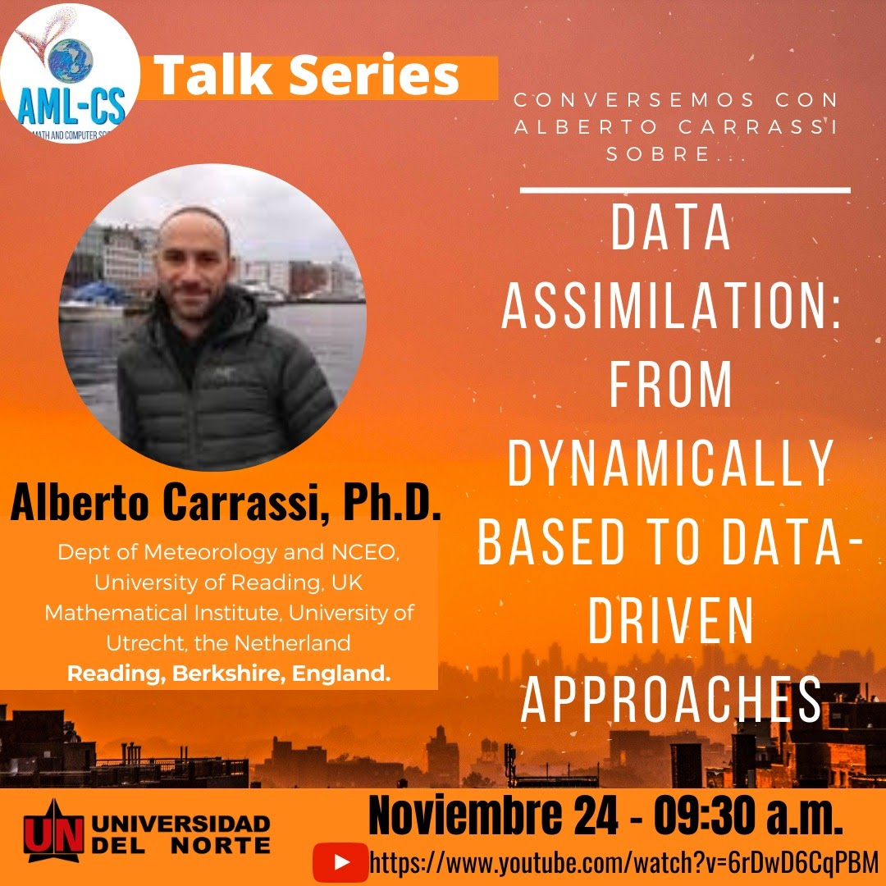



	

    
		
      <b>31/07/2020 - Spanish</b>
			Algunos Aspectos Teóricos y Prácticos de la Asimilación de Datos en la Predicción Meteorológica. Centro de Modelización Matemática (MODEMAT)l, Ecuador.
		
	

  

    
		
      <b>14/08/2020 - English</b>
			Scientific Machine Learning and its Potentials. Associate Professor, Willamette University, USA.
		
	

  

    
		
      <b>28/08/2020 - English</b>
			Nature-Inspired Algorithms: Challenges and Open Problems, Senior Research Scientist at National Physical Laboratory, MiddleSex University, UK.
		
	

	

    
		
      <b>11/09/2020 - English</b>
			Calibration and Kalman Filtering for Tide and Storm-Surge Models. Senior Researcher Oceanography/Mathematics. DELTARES. The Netherlands.
		
	

	

    
		
      <b>12/11/2020 - Spanish</b>
			Towards scalable algorithms for distributed optimization and learning. Massachusetts Institute of Technology.
		
	

	

    
		
      <b>24/11/2020 - English</b>
			Data assimilation: from dynamically based to data-driven approaches. Dept of Meteorology and NCEO, University of Reading, UK. Mathematical Institute, University of Utrecht, the Netherland.
		
	

	

    
		
      <b>18/03/2021 - Spanish</b>
			Model error covariance estimation in particle filters using batch and online smoother-free adaptations of the Expectation- Maximization algorithm. Dpto Matemática, FaCENA, UNNE y CONICET. Argentina.
		
	


